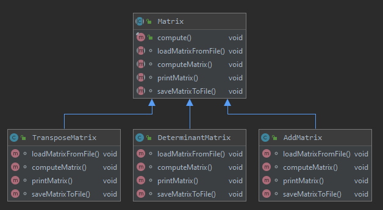

# ДЗ: Паттерн Шаблонный метод
Написать программу, которая выполняет следующее:
На входе получает название входного файла, выходного файла и вид операции
1. Получает данные из файла
2. Выполняет указанную операцию над данными
3. Формирует данные для вывода в необходимом формате
4. Записывает данные в выходной файл
5. нарисовать диаграмму классов.

# Диаграмма классов
